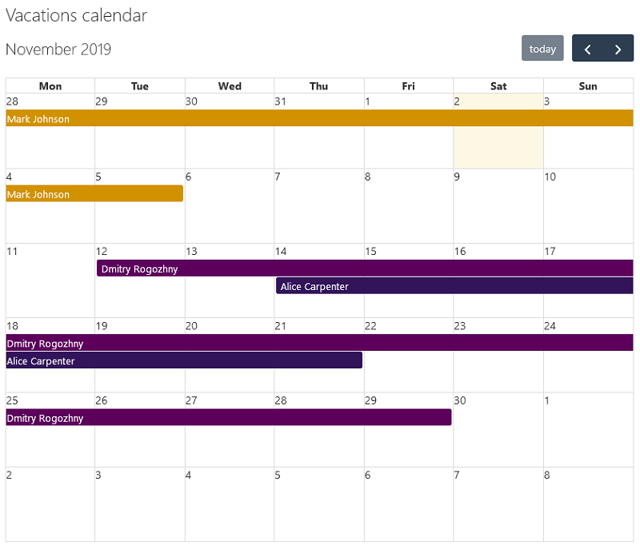
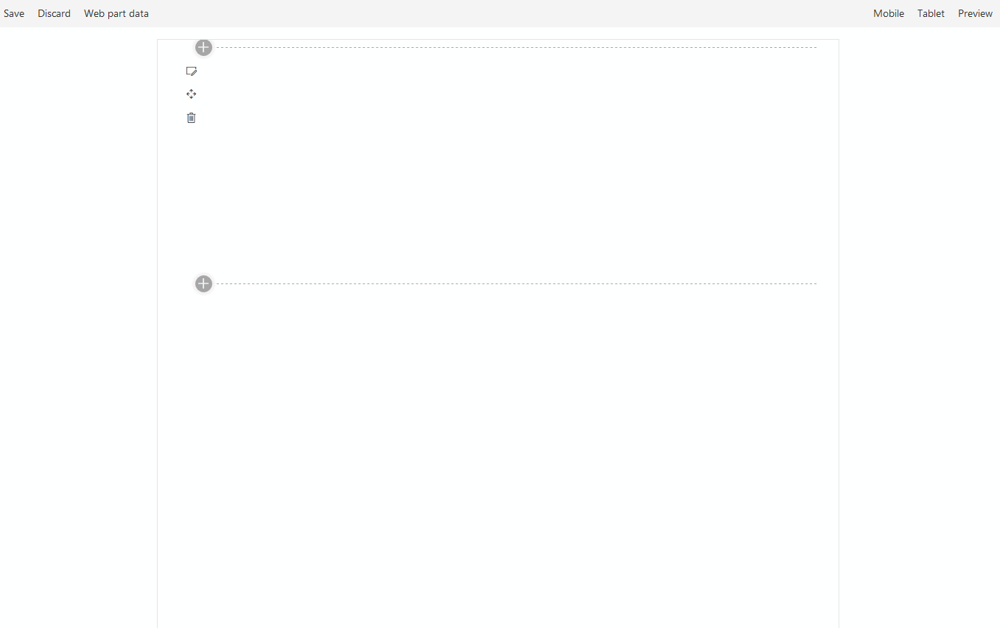

# Calendar

## Summary
This project contains a SharePoint Framework web part that shows a month calendar with a list of events.



The web part contains following properties:
- Events list&thinsp;&mdash;&thinsp;SharePoint list with events to display.



## Used SharePoint Framework Version


## Minimal path to awesome
```bash
git clone the repo
npm install
gulp serve
```

## Features
This sample illustrates the following concepts on top of the SharePoint Framework:
- Using React for building SharePoint Framework web parts.
- Using [@pnp/pnpjs](https://pnp.github.io/pnpjs/documentation/getting-started/) package to get SharePoint list items.
- Using [WebPartTitle](https://sharepoint.github.io/sp-dev-fx-controls-react/controls/WebPartTitle/) reusable control from [@pnp/spfx-controls-react](https://sharepoint.github.io/sp-dev-fx-controls-react/).
- Using [PropertyFieldListPicker](https://sharepoint.github.io/sp-dev-fx-property-controls/controls/PropertyFieldListPicker/) control from the [@pnp/spfx-property-controls](https://sharepoint.github.io/sp-dev-fx-property-controls/) package of reusable property pane controls.
- Using [FullCalendar](https://fullcalendar.io/) component.
