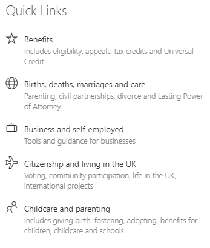

This project includes two web parts:
- [LinksTree](#linkstree)---shows the hierarchy of categories along with a related content. Makes the navigation in the hierarchy of categories easy.
- [LinksList](#linkslist)---shows a list of links. Can be used as an entry point on a landing page to make the navigation easier. Links can navigate to different categories of the `LinksTree` web part or point to external links.

## LinksTree

The `LinksTree` web part shows a strcture of categories along with a related content. Here's an example of the configuration for the web part:


The configuration for the web part is provided with a JSON object that describes data categories and a content.

The categories in the hierarchy can be nested as deep as needed (you need to control the usability of the final configuration though).

> See [JsonDataProvider](#JsonDataProvider) for the JSON schema.

## LinksList

The `LinksList` web part is a supplementary web part that can be used as an entry point for the `LinksTree` web part.

The web part displays a list of links that navigate to a specific path in the `LinksTree` web part.


> It is similar to the standard `Quick Links` web part. The advantage of the `LinksList` web part is that it shows categories top-to-bottom and left-to-right, while the `Quick Links` shows categories left-to-right top-to-bottom. This might get important if you want to show a prioritized list (or a sorted from A to Z list) - top-to-bottom first order makes it easier to read.
>
> In the example above categories go in the alphabetical order from top to bottom first and then wrap from left to right.

The web part configuration contains the JSON with categories to display. The same schema is used as for the `LinksTree`. Additionaly a target page Url should be configured, pointing to a page where an instance of the `LinksTree` web part is configured.

If the `url` is not specified for a link in the JSON configuration, it will point to the target page with added `path` parameter. The key of the category will be used for the path. If the `url` is provided, this Url will be used.

## Using standard SharePoint web parts

Standard SharePoint web parts can be used as well to navigate users to a page with a `LinksTree` web part. Good candidates for that are `Text`, `Image`, and `Quick Links` web parts.
Below are some examples.

Image web part:


Quick Links web part:



By navigating to  a specific Url we can define the selected path for a web part. `LinksTree` web part is looking at the `path` value in the url hash for a path selected by default during the initial page load.

For example, the url https://myCompany.sharepoint.com/sites/KB/SitePages/Browse.aspx#path=HR&Policies would pre-select the following path: `[HR, Policies]` and would display a list of links configured for that path.

> To get the right Url you can navigate to the desired section in the web part and copy the Url. Every time you select a section, the web part updates the `path` part of the Url's hash.

## Data Sources

Lets consider the following example structure:
- Category 1
  - Category 1-1
  - Category 1-2
    - Category 1-2-1
    - Category 1-2-2
- Category 2
  - Category 2-1
  - Category 2-2
- Category 3
  - Category 3-1
  - Category 3-2

Every category in the structure has got a set of properties. The value of the `nane` property is displayed to users, and the `key` allows to uniquely identify the category on its level. For example, `Category 1-1` and `Category 1-2` should have different keys; while `Category 1` and `Category 1-1` keys may duplicate (that is not a problem as they are on different levels).

## Data Providers

Using data providers we can get categories from a structure by a path. Let's consider a couple of examples:
- empty path [] would return a list of root-level categories: `[Category 1, Category 2, Category 3]`.
- path `[Category 1]` would return sub-categories for the `Category 1`: `[Category 1-1, Category 1-2, Category 1-3]`.
- path `[Category 1, Category 1-2]` would return: `[Category 1-2-1, Category 1-2-2]`.

Data providers are responsible for providing data for web parts. All data providers should implement the [IDataProvider](./src/data/IDataProvider.ts) interface.

### IDataProvider

Operations defined in the [IDataProvider](./src/data/IDataProvider.ts) interface allow to get the hierarchical data and a content required by the web parts.

The following operations are defined:
- `getRoot(): Promise<ICategory[]>`---returns a Promise that resolves with a list of root-level categories.
- `getByPath(path: ICategory[]): Promise<ICategory[]>`---gets a list of categories that define a path and returns a Promise that resolves with a list of categories for the specified path.
- `getCategoriesByKeys(keys: string[]): Promise<ICategory[]>`---gets a list of keys of categories that define a path and returns a Promise that resolves with the categories for that keys.
- `getContent(path: ICategory[]): Promise<IContent | undefined>`---gets a list of categories that define a path and returns a Promise that resolves with a content if it's available.

Components in web parts require a valid data provider specified as a property. A data provider allows to get the required data. Depending on requirements the data can be stored in different locations. Some valid options include a web part property, SharePoint category with configuration, SharePoint list (with folders as categories), SharePoint Search index, external data sources.

> Note: Data providers are responsible for data caching. If data requests are expensive, a data provider should implement the right caching strategy to make the consequent requests faster.

### ICategory

The information returned for the category is described by the `ICategory` interface.

```
export interface ICategory {
  name: string;
  key: string;
  url: string;
  icon?: string;
  description?: string;
}
```

The interface can be modified to include additional data.

### IContent

Ther information about a content for a category is described by the `IContent` interface.

```
/**
 * Interface that describes a content. The content has got a name and a list of sections.
 * Every section has got a name and a set of links.
 */
export interface IContent {
  name: string;
  sections: IContentSection[];
}

/**
 * Interface for a content section.
 */
export interface IContentSection {
  name: string;
  links: IContentLink[];
}

/**
 * Interface for a content link.
 */
export interface IContentLink {
  name: string;
  url: string;
}
```

The example above describes the content as a list of links grouped into sections. The content can be described in other ways. Valid options include: list of documents or categories, links to a content that should be loaded into the `<iframe>`.

This interface can be changed to reflect the requirements for a specific content.

## JsonDataProvider

`JsonDataProvider` is an implementation of the `IDataProvider` that stores the data in a JSON property. A Json data is provided to a provider instance during the creation. After that, the provider can be used to retrieve that data.

The configuration for the provider can be persisted in a web part property or in a SharePoint list category.

### Json schema

An example of the JSON expected by the provider is available in [demoCategoriesTree.json](./src/data/demoCategoriesTree.json) file.

The schema for the data is described in the [JsonDataProvider.ts](./src/data/JsonDataProvider.ts) with `IGroupData, IGroup, IContentSection, and IContent` interfaces.


## Other data provider options

Here are some ideas for data providers:
- **SharePoint list**---use a list of folders and sub-folders. The folders' structure act as data categories. As a content we can display a list of folder's categories or some other content (link to a content can be specified in a folder's category properties or an category in a folder). Advantages of this approach is that the structure (i.e. folders) can be edited using standard SharePoint interface for managing lists and folders.
- **SharPoint search**---use a list of data categories defined in JSON or a SharePoint list as a structure. For the content we can use the search results. A query for a search is generated using the categories path (e.g. categories path `[HR, Policies, Vacation]` would search for documents tagged with the corresponding metadata or in a specific site).
