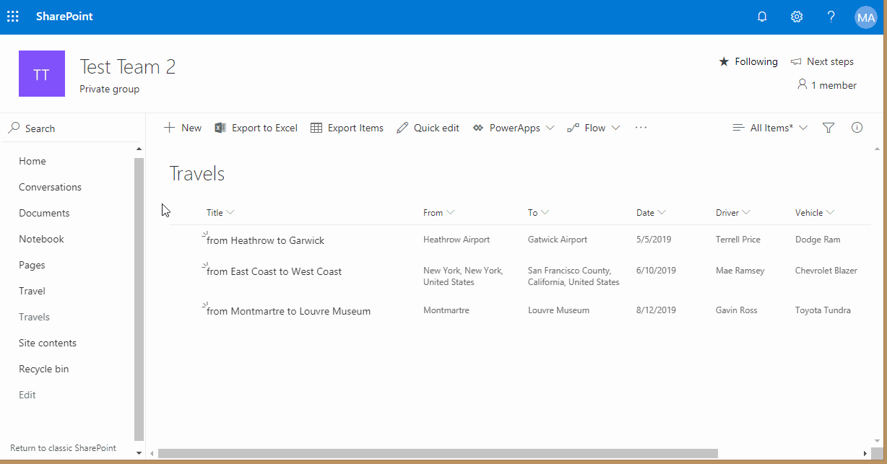
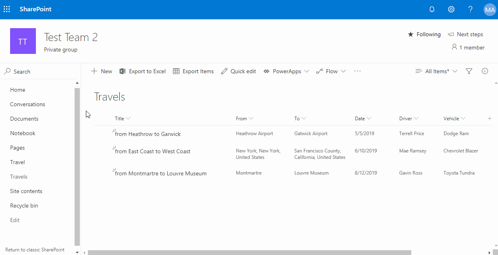
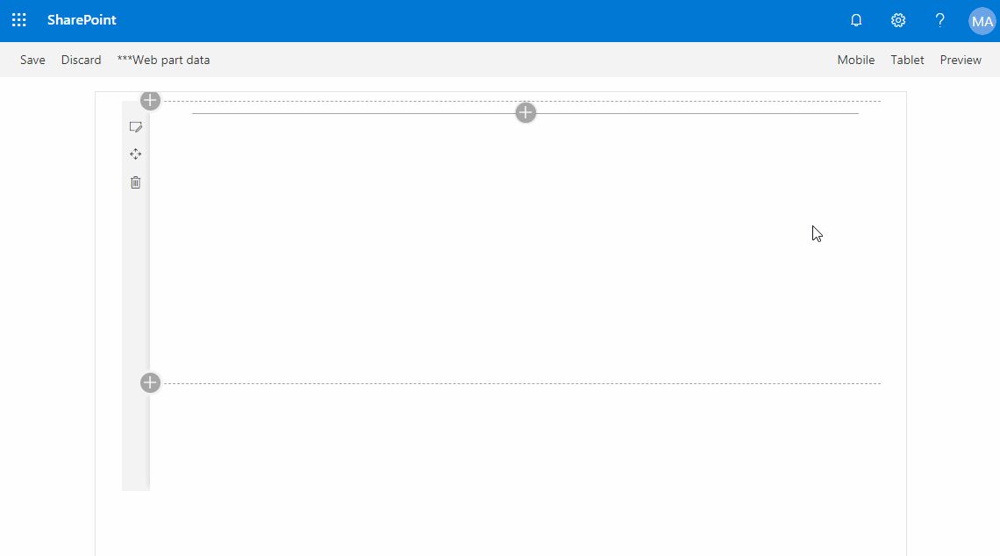

# Export to Pdf

This project demonstrates how export to Pdf can be implemented with a client code only.

It shows how to export information from SharePoint List items to Pdf files.

> Note: This is a demo project, use your development or test tenant for running the demo.

## Extension with ListViewCommandSet
The first example contains a SharePoint Framework extension that adds 3 custom actions to a list command bar:
1. Export Items---gets the selected items and renders a Pdf document for them.
2. Export Item---gets a single selected item and renders a Pdf document for it.
3. Travel List---gets a single selected item and generates an example of a travel list. Travel list contains a list of fields for the selected item, an image for the item's route and a link to a Bing Maps route.

## Export To Pdf Web part
The second example is the `Export to Pdf` web part that allows to perfom the same actions as the extension.

The title of the list with travel items should be specified in web part's properties.

## Travels List
This demo uses a Travel list, that contains fields to describe a travel between two locations. You can provision this list on a site by running the [./src/CreateTravelsList.ps1](./src/CreateTravelsList.ps1) script.

The template file for a list is available at [./src/travels.xml](./src/travels.xml).

> You can run the script like this: CreateTravelsList.ps1 -Site SITE_URL -FilePath FILE_PATH
>
> where SITE_URL is the url of a site, where a list should be added, and FILE_PATH is a path to the template.

This list contains the following columns (the type of a column is specified in brackets):
- Title (string)
- From (Location)
- To (Location)
- Date (Date)
- Driver (Choice)
- Vehicle (Choice)

__Export a list of items__:

__Export a single item__:

__Create a travel list__:

__Export to Pdf web part__:

## How to install the demo
1. Clone the repo.
2. Run `npm install` to get all the dependencies.
3. Run the [./src/CreateTravelsList.ps1](./src/CreateTravelsList.ps1) script to provision the Travels list (see [Travels List](#travels-list) for details).
4. Optionally, if you want to get the map image for a travel list, get the Bing Maps API key and run the [./src/SetBingMapKey.ps1](./src/SetBingMapKey.ps1) script (see [Bing Maps API Key](#bing-maps-api-key) for details).
5. Start the demo project by running `gulp serve`.
6. For list custom actions, open the Travels list and add a debug string to the Url: `?loadSPFX=true&debugManifestsFile=https://localhost:4321/temp/manifests.js&customActions={"bae5c64a-bec8-4785-a546-225fc94caa36":{"location":"ClientSideExtension.ListViewCommandSet"}}`
7. For a web part, open the workbench page at `https://YOUR_TENANT_NAME.sharepoint.com/sites/YOUR_SITE_NAME/_layouts/15/Workbench.aspx` and add the `Export to Pdf` web part.

## Bing Maps API Key
This project requires a valid Bing Maps API Key for the generation of a map for a travel list (i.e. `Travel List` action).
You would need to get the valid Bing Maps API key first, and then configure your environment to use it.

> Note: Without a valid Bing Maps API key the `Travel List` action will stil work, but no map will be generated.

### How to get the Bing Maps API Key
You can obtain your own API key for free at the [Bing Maps Dev Center](https://www.bingmapsportal.com/). You would need to sign in with your Microsoft account to get a key.

### How to configure this example with your Bing Maps API key
The [./src/SetBingMapKey.ps1](./src/SetBingMapKey.ps1) script allows to configure the API key that will be used by examples. You would need a tenant administrator account to run the script.

> You can run the script like this: SetBingMapKey.ps1 -Tenant YOUR_TENANT_NAME -BingMapsApiKey YOUR_BING_MAPS_API_KEY
>
> where YOUR_TENANT_NAME is the name of your tenant, and YOUR_BING_MAPS_API_KEY is a valid Bing Maps API key.
