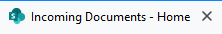

## FavicoNotification sample

A sample SharePoint Framework extension that shows how to add favico notifications for SharePoint Online sites.



The demo uses timer to increase a counter in a favico icon.

### Implementation details

The [favico.js](http://lab.ejci.net/favico.js/) library is used to display notifications. The package with the library is added with `npm install favico.js`, TypeScript declarations are defined in the `./src/favicojs.d.ts` file.

### Local test

To test the extension without deploying the package, define your Url in `./config/serve.json` and run `gulp serve`.

Your site will open in a browser with a target Url and `?debugManifestsFile=https%3A%2F%2Flocalhost%3A4321%2Ftemp%2Fmanifests.js&loadSPFX=true&customActions={"a689601a-d309-4410-a867-0a4e3824363e"%3A{"location"%3A"ClientSideExtension.ApplicationCustomizer"%2C"properties"%3A{}}}` at the end.

### Deploy solution

You need to upload the package to the App catalog site collection. You can use the pre-built `./package/favico-notification.sppkg` package or build it with the source code.

Once deployed, you can add custom action to a site to activate the extension. Here's the example with PnP PowerShell:
```
Connect-PnPOnline https://YOURTENANT.sharepoint.com/sites/YOURSITE

Add-PnPCustomAction -Title "FavicoNotification" -Name "FavicoNotification" -Location "ClientSideExtension.ApplicationCustomizer" -ClientSideComponentId a689601a-d309-4410-a867-0a4e3824363e -ClientSideComponentProperties "{}"
```

### Browser support
- Chrome: Yes
- Firefox: Yes
- Opera: Yes
- IE: No
- Edge: No
- Safari: No (Safari hides favicons)
