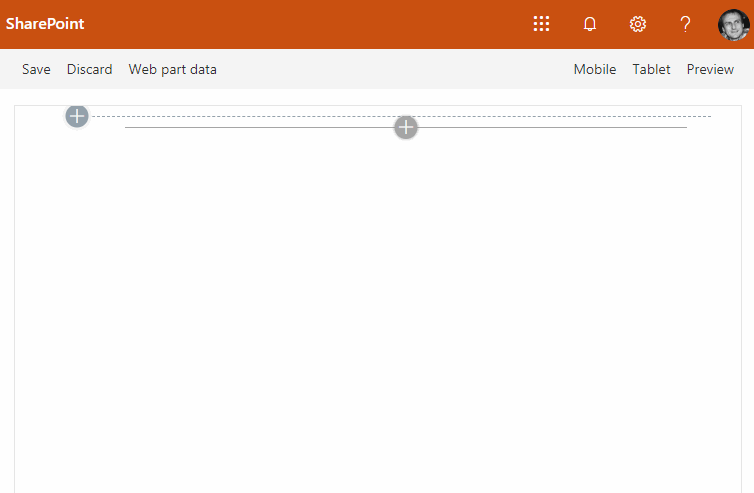

## Rich text editor with people picker

This sample solution is a SharePoint Framework web part that allows to edit text and add users' mentions with @. Users are displayed as tiles with image and name. A detailed user card is displayed on hover:

This sample combines [Microsoft Graph Toolkit](https://docs.microsoft.com/en-us/graph/toolkit/overview), [Quill.js](https://quilljs.com/) text editor, and [@mentions for Quill](https://github.com/afconsult/quill-mention).

This samaples highlights the usage of following frameworks and libraries:
- SharePoint Framework for implementing web parts.
- React.js for implementing components.
- [Quill.js](https://quilljs.com/) text editor.
- [React-Quill](https://github.com/zenoamaro/react-quill)&thinsp;&mdash;&thinsp;a Quill component for React.
- [quill-mention](https://github.com/afconsult/quill-mention)&thinsp;&mdash;&thinsp;@ mentions for the Quill.
- Custom Quill Blot for rendering mentions with Graph toolkit.
- [Microsoft Graph Toolkit](https://docs.microsoft.com/en-us/graph/toolkit/overview) for displayin person cards.
- `SPPeopleSearchService` people search service from [@pnp/spfx-controls-react](https://sharepoint.github.io/sp-dev-fx-controls-react/).-
