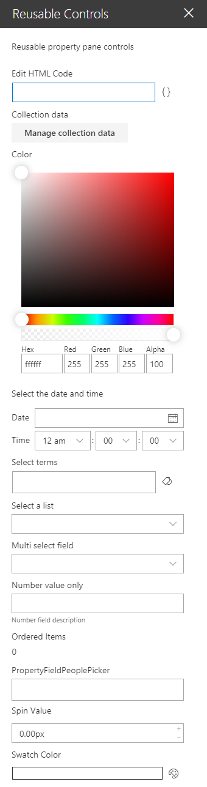

# Review of @pnp/spfx-property-controls

Two web parts that give an overview of the [@pnp/spfx-property-controls](https://sharepoint.github.io/sp-dev-fx-property-controls/) reusable property pane controls for SPFx solutions.

The code highlights how reusable controls can be added to a web part and how to access their values.

The @pnp/spfx-property-controls package provides two types of controls:
- [Controls](https://sharepoint.github.io/sp-dev-fx-property-controls/controls/PropertyFieldCodeEditor/) that provide some unique selection scenario;
- [Controls](https://sharepoint.github.io/sp-dev-fx-property-controls/controls/PropertyFieldButtonWithCallout/) that look like standard SPFx property pane controls with callout panes added.

## Reusable Controls Web Part
This web part shows how to use reusable property pane controls.



## Reusable Controls With Callout Web Part
This web part shows reusable property pane controls with callouts.


### Minimal path to awesome

```bash
git clone the repo
npm i
npm i -g gulp
gulp serve
```
