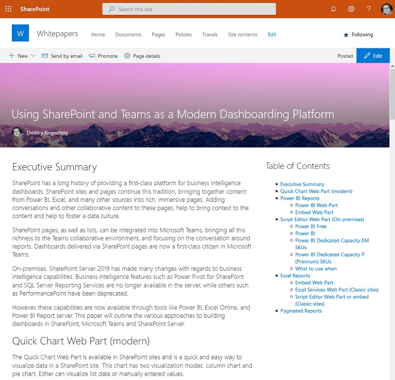
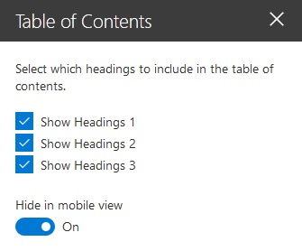
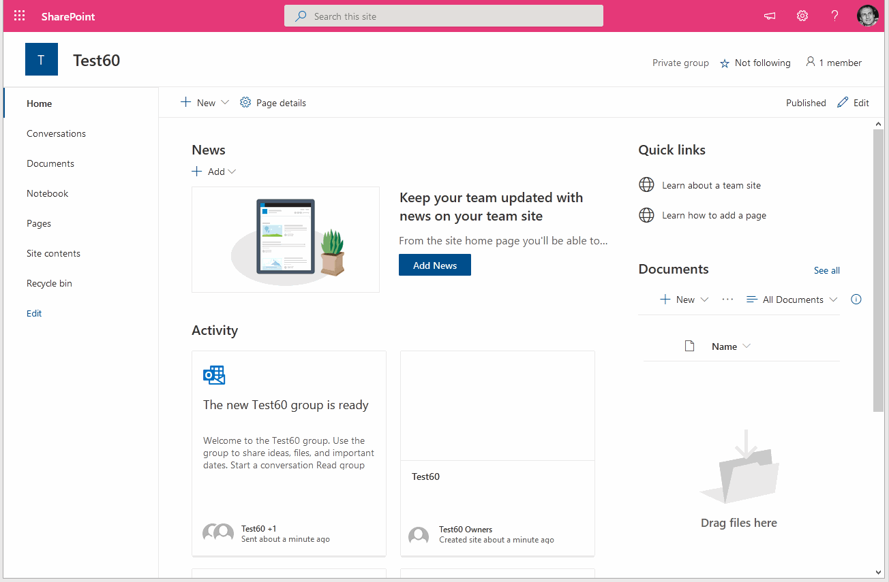

# Table of Contents Web Part

## Summary
This SharePoint Framework web part displays a table of contents for the current page.

### Web part properties

The web part provides the following properties:
- `Show Headings 1`&thinsp;&mdash;&thinsp;whether to show H1 headings.
- `Show Headings 2`&thinsp;&mdash;&thinsp;whether to show H2 headings.
- `Show Headings 3`&thinsp;&mdash;&thinsp;whether to show H3 headings.
- `Hide in mobile view`&thinsp;&mdash;&thinsp;whether to hide the web part on small screens.
- `Title`&thinsp;&mdash;&thinsp;allows to specify the title for the web part. You can edit the title directly in the web part's body.

## Minimal Path to Awesome
### Pre-built package
You can grab the pre-built packaged ready for deployment from [./release/table-of-contents.sppkg](https://github.com/dmitryrogozhny/sharepoint-lab/blob/master/table-of-contents/release/table-of-contents.sppkg).

Here's how to deploy the web part to the site collection's app catalog:

### Local testing
- Clone this repository
- In the command line run:
  - `npm install`
  - `gulp serve`

### Deploy
- `gulp clean`
- `gulp bundle --ship`
- `gulp package-solution --ship`
- Upload .sppkg file from sharepoint\solution to your tenant App Catalog
  - E.g.: https://<tenant>.sharepoint.com/sites/AppCatalog/AppCatalog
- Add the web part to a site collection, and test it on a page
