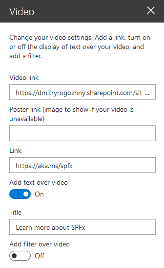

# video

## Summary
This project contains a SharePoint Framework web part that shows a video with an optional link and text.


The web part contains following properties:
- Video link&thinsp;&mdash;&thinsp;link to a video file;
- Poster link&thinsp;&mdash;&thinsp;link to an image that will be shown if a specified video is not available;
- Link&thinsp;&mdash;&thinsp;optional link to navigate to;
- Add text over video&thinsp;&mdash;&thinsp;toggle whether a text should be displayed over a video;
- Title&thinsp;&mdash;&thinsp;text to show over a video;
- Add filter over video&thinsp;&mdash;&thinsp;toggle whether to apply a dimming filter over a video.



## Used SharePoint Framework Version


## Minimal path to awesome
```bash
git clone the repo
npm install
gulp serve
```

## Features
This sample illustrates the following concepts on top of the SharePoint Framework:
- Using React for building SharePoint Framework web parts.
- Support for a full-width column layout.
- Using Placeholder reusable control from [@pnp/spfx-controls-react](https://sharepoint.github.io/sp-dev-fx-controls-react/).
- Using [Office UI Fabric](https://developer.microsoft.com/en-us/fabric#/) for responsive layout.
- Using React functional components and higher order components (HOC).
